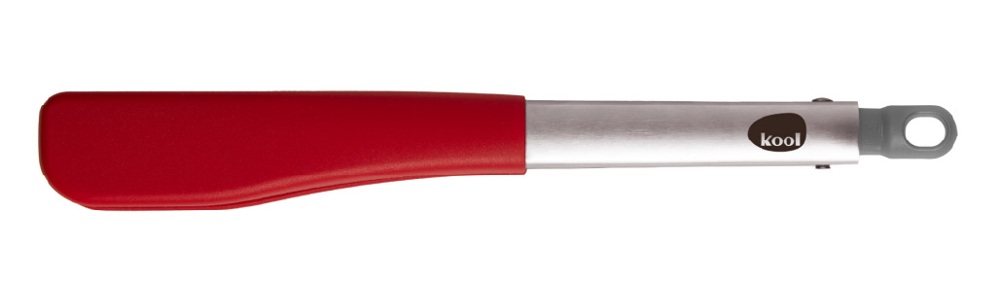
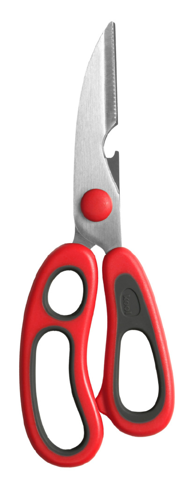
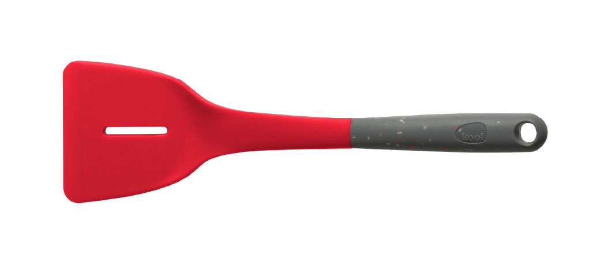

#Update product list instructions

###script.js
Search "const" and update

for example :

```
const knives = {
  big: ['santoku', 'chef', 'bread', 'chopper'],
  small: ['utility', 'paring'],
  others: ['choppingBoard', 'tongs', 'scissors',***'turner'***]
};
```

###translation.js

```
    // product list start //
    chefKnife: "Chef Knife",
    santokuKnife: "Santoku Knife",
    breadKnife: "Bread Knife",
    chopperKnife: "Chopper Knife",
    utilityKnife: "Utility Knife",
    paringKnife: "Paring Knife",
    choppingBoard: "Chopping Board (Coming Soon)",
    tongs: "Tongs (Coming Soon)",
    scissors: "Scissors (Coming Soon)",
    ***turner: "Turner (Coming Soon)"***
    // product list end //


    // product list start //
    chefKnife: "主廚刀",
    santokuKnife: "三德刀",
    breadKnife: "麵包刀",
    chopperKnife: "砍刀",
    utilityKnife: "多用途刀",
    paringKnife: "削皮刀",
    choppingBoard: "砧板（即將推出）",
    tongs: "夾子（即將推出）",
    scissors: "剪刀（即將推出）",
    ***turner: "鑊鏟（即將推出）"***
    // product list end //
```


###index.html
Search "product-picker" and update

for example :

```
<div id="product-picker">
        <label class="product-option">
          <input type="checkbox" name="product" value="chef.jpg" data-thumb="chef-thumb.jpg" data-name="chef">
          
          <span data-i18n="chefKnife">Chef Knife</span>
        </label>
        <label class="product-option">
          <input type="checkbox" name="product" value="santoku.jpg" data-thumb="santoku-thumb.jpg" data-name="santoku">
          
          <span data-i18n="santokuKnife">Santoku Knife</span>
        </label>
        <label class="product-option">
          <input type="checkbox" name="product" value="bread.jpg" data-thumb="bread-thumb.jpg" data-name="bread">
          
          <span data-i18n="breadKnife">Bread Knife</span>
        </label>
        <label class="product-option">
          <input type="checkbox" name="product" value="chopper.jpg" data-thumb="chopper-thumb.jpg" data-name="chopper">
          
          <span data-i18n="chopperKnife">Chopper Knife</span>
        </label>
        <label class="product-option">
          <input type="checkbox" name="product" value="utility.jpg" data-thumb="utility-thumb.jpg" data-name="utility">
          
          <span data-i18n="utilityKnife">Utility Knife</span>
        </label>
        <label class="product-option">
          <input type="checkbox" name="product" value="paring.jpg" data-thumb="paring-thumb.jpg" data-name="paring">
          
          <span data-i18n="paringKnife">Paring Knife</span>
        </label>
        <label class="product-option">
          <input type="checkbox" name="product" value="tongs.jpg" data-thumb="tongs-thumb.jpg" data-name="tongs">
          
          <span data-i18n="tongs">Tongs</span>
        </label>
        <label class="product-option">
          <input type="checkbox" name="product" value="scissors.jpg" data-thumb="scissors-thumb.jpg" data-name="scissors">
          
          <span data-i18n="scissors">Scissors</span>
        </label>
        <label class="product-option">
          <input type="checkbox" name="product" value="chopping-board.jpg" data-thumb="chopping-board-thumb.jpg" data-name="choppingBoard">
          
          <span data-i18n="choppingBoard">Chopping Board</span>
        </label>
        ***<label class="product-option">
          <input type="checkbox" name="product" value="turner.jpg" data-thumb="turner-thumb.jpg" data-name="turner">
          
          <span data-i18n="turner">Turner</span>
        </label>***
      </div>
```